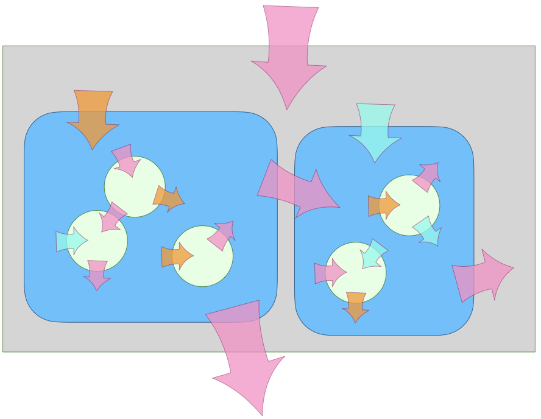

# A Taxonomy of Security Issues
## for understanding language-based security and modularity.
  
by Mark S. Miller, [Agoric](https://agoric.com/)

Increasingly, programmers build secure systems using secure programming languages. What does language-based security contribute to overall system security? What is the relationship between building secure systems and building modular composable systems? Is language-based security competitive with, or complementary to, OS-based security? If we cannot stop secrets from leaking *outward* onto side channels like [Meltdown and Spectre](https://meltdownattack.com/), as seems plausible, what forms of security become impossible?

The term "security" is an overly broad umbrella term, creating much confusion about these matters. We need some distinctions. After presenting a taxonomy of issues and approaches, this essay explains what forms of security are possible using which technologies and what forms of security are necessary for large-scale software engineering. We illustrate with issues from the design of JavaScript, and of SES, the object-capability form of JavaScript.

## Integrity, Availability, Confidentiality

We start with the traditional distinction between integrity, availability, and confidentiality.

   * ***Integrity***, also known as *Safety* or *Consistency*: No "bad" things happen. Bob stealing Alice’s money would be an integrity violation. Integrity rests on *access control* determining what agents can cause what effects.
   * ***Availability***, also known as *Liveness* or *Progress*: "Good" things continue to happen. Bob preventing Alice from spending her money would be an availability violation, also known as a *denial of service*. The most common threats to availability are *resource exhaustion attacks*, such as Bob allocating memory that Alice needs to proceed.
   * ***Confidentiality***, also known as *Privacy* or *Secrecy*: No one can infer information they were not supposed to know. Bob figuring out Alice’s secret balance would be a confidentiality violation. The most pernicious threats to confidentiality are *side channels* like Meltdown and Spectre, where Bob infers Alice's secrets from timing differences.

## Integrity first

An important principle followed by memory-safe languages and many operating systems is *integrity should never depend on confidentiality*. Put another way, integrity should never be threatened by a loss of confidentiality. A JavaScript object reference is unforgeable even by JavaScript code that happens to know how objects are laid out in memory. Public blockchains like Ethereum dramatically demonstrate the independence of integrity from confidentiality: All Ethereum computation is public. Ethereum programs *cannot* keep secrets. Nevertheless, they deliver strong integrity and availability under hostile conditions. The discovery of Meltdown and Spectre did nothing to weaken Ethereum’s security.

Integrity is the bridge between "normal" software engineering and software "security". The central problem of both is [robust composition](http://www.erights.org/talks/thesis/). When we compose separately written programs, so that they may cooperate, they may instead destructively interfere with each other. To gain the benefits of composition while minimizing potential interference, we invent modularity and abstraction mechanisms. In JavaScript: memory safety, closure encapsulation, private instance fields, object freezing, module separation, realm separation, membrane separation, encapsulation-preserving reflection, shared-nothing communicating event loops; these all defend integrity.

Software engineering defends integrity against accidental interference, *bugs*. Software security defends integrity against intentional interference, *attacks*. It is no coincidence that mechanisms effective against one are effective against the other. Good modularity mechanisms are effective against interference, whether intentional or not.

## Nested Boundaries and Channels

Operating system security is based on process boundaries separating address spaces. This rests on simple hardware mechanisms--MMUs mapping virtual to physical memory addresses--that have withstood the test of time. Despite a long history of attacks against OSes, hardly any have been against this basic separation mechanism. By contrast, language-based security builds boundaries within a process. History shows that these finer-grain boundaries are much harder to get right. Meltdown and Spectre amplify this difference. These side channels are  leakier within a process than between processes.

A common position holds that because process boundaries are so solid, we don't need finer-grain boundaries within a process. This is like saying that because the walls of your house are a defensible perimeter, you do not need skin. Because you have skin, you do not need cell membranes.

Of course biology does not work this way. Instead, we ourselves are composed of systems at multiple nested granularities: organelles, cells, organs, organisms, hives. Likewise we ourselves compose software systems at multiple nested granularities: closures, classes, modules, packages, realms, workers. In both biological and software systems, at each granularity, to gain the benefits of composition, defensible boundaries reduce potential interference. Defending boundaries at multiple scales simultaneously produces a [multiplicative reduction in risk](https://www.youtube.com/watch?v=g28yRvHKIgc&list=PLKr-mvz8uvUgybLg53lgXSeLOp4BiwvB2). Different boundaries have different characteristics, but they have many abstract organizational principles in common.

One of those principles is that boundaries are built to be semi-permeable, to allow some things to pass while blocking others. The boundaries at different granularities differ in what they can block, and in what their channels can carry across. As a result, they differ in what kinds of composition they can support and in what kinds of interference they can prevent. Let’s break this down again by integrity, availability, and confidentiality.

Out of the box, JavaScript contains flaws that weaken fine grain integrity--non-static scoping and the potential for prototype poisoning--as well as antidote features--strict mode and `Object.freeze`--for repairing these flaws to support [SES](https://github.com/tc39/proposal-ses), an [object-capability](https://en.wikipedia.org/wiki/Object-capability_model) (ocap) form of JavaScript. In SES, [integrity is pervasive](https://research.google/pubs/pub37199/), from the finest grain of memory safety and closure encapsulation to the large grain of asynchronous messages between processes on distant machines. The boundaries at all granularities can defend integrity flawlessly by blocking effects.

*By themselves*, fine grain boundaries cannot protect confidentiality. They cannot block the leakage of information over timing channels--by measuring the time that different operations take. Fine grain boundaries are totally unable to defend availability. At fine-grain, denial of service is as trivial as an infinite loop.

   * Integrity can be strong at all granularities.
   * At all granularities within one thread of control, anything can trivially block everything, so we cannot defend availability at all. The minimal defensible unit for availability is the shared-nothing concurrent thread of control, such as a [process, worker, or vat](https://agoric.com/papers/concurrency-among-strangers/abstract/). The blockage of one need not prevent the progress of others.
   * Confidentiality, it turns out, is more interesting.

## Overt Channels, Side Channels, Covert Channels

For language-based security, the interacting agents are programs written in a programing language, whose behaviors are based on

   * the specified semantics of the programming language
   * the actual implementations of the programming language

This duality gives us our distinction between kinds of channels for conveying information or effects. For each channel, we have *sender Sam* and *receiver Rachel*.

   * An ***overt channel*** is one that the specification of the language says will convey information. Sam assigning `i = 1` communicates `1` to Rachel who can read `i`. In an ocap language, overt causality is carried only on shared lexical variables and on references, so subgraph isolation also isolates overt communications channels.
   * A ***non-overt channel*** relies on unspecified behaviors of actual implementations. Languages generally do not specify the duration of various operations. The most common non-overt channels, including Meltdown and Spectre, rely on Rachel measuring the durations of various operations.

There are two kinds of non-overt channel:

   * A ***side channel*** is a non-overt channel where Sam, the source of the leaked information, does not intend to leak the information to Rachel. For example, if Sam is an encryption algorithm encapsulating an encryption key, Rachel might ask Sam to encrypt text she has chosen to amplify differences in secret key bits into timing differences she can measure.
   * A ***covert channel*** is a non-overt channel where Sam intends to leak the information to Rachel. Sam may purposely vary durations of internal operations in order to signal to Rachel.

It is much easier to defend against side channels, where Sam accidentally leaks, than defend against covert channels, where Sam is actively trying to signal. But it is **no easier** to be invulnerable against side channels than covert channels. This seems paradoxical. By "defend" I mean imperfectly. By "invulnerable" I mean perfectly. Any misbehavior that Sam might engage in intentionally, he may engage in innocently. The probability distributions differ, but not the line between possible and impossible. Good protection mechanisms prevent leakage, whether intentional or not.

A correct program relies only on the specified semantics of the programming language it is written in. Although a correct Sam may leak information over non-overt channels, a correct Sam only acts on information he receives over overt channels. We can thus [ignore non-overt channels and still reason soundly about Sam’s integrity](http://www.evoluware.eu/fsp_thesis.pdf).

Much formal reasoning about confidentiality of programs starts by assuming away the existence of non-overt channels. Such reasoning is unsound. Whatever safety conclusions it arrives at are suspect. But neither is it practical to reason about implementations, as that reasoning must be redone from scratch with each new implementation of the language. Meltdown and Spectre show that this burden extends to each new implementation of a machine’s instruction set architecture! Without reasoning about specific implementations, how may we soundly defend confidentiality?

By definition, non-overt channels are found in the gap between the language’s specified semantics and actual implementations. A perfectly deterministic language would close this gap--it would fully specify all observable effects of running a program on any correct implementation of the language. However, such programs could not interact with the outside world, even to read the clock, since the time values must be predetermined by the language’s semantics.

We avoid this I/O problem in ocap languages that are *[fully virtualizable](https://en.wikipedia.org/wiki/Popek_and_Goldberg_virtualization_requirements)* in the sense  discovered by processor architects, where there is a strict separation between the *user-mode* purely computational language vs the *system-mode* (host) objects that provide I/O access to the external world. [SES](https://github.com/tc39/proposal-ses) leverages JavaScript’s almost perfect conformance to this model and repairs the remaining gap.

The purely computational SES language does not have a fully deterministic spec because the purely computational elements of JavaScript do not. But this remaining gap leaks only relatively static information such as what version of what JavaScript engine is being run. It does not leak [information that changes dynamically while a program runs](https://github.com/tc39/proposal-ses#how-deterministic), and thus does not provide non-overt channels between SES programs. All access to dynamic non-determinism, including all access to the outside world, is provided by [virtual host objects](https://github.com/Agoric/proposal-preserve-virtualizability) that can be denied or [further virtualized](https://www.youtube.com/watch?v=z6H1OnI46dY&list=PLzDw4TTug5O3vIAd4IR1Gp5t_46co_dv9) as one subsystem creates another. If Rachel is a subsystem that has been denied all such sources of non-determinism, then no matter how leaky Sam is, whether intentionally or not, Rachel cannot read the non-overt signals Sam is sending.

## Least Authority Linkage

Most applications need to interact with the world outside of themselves, including the user or the network. Such applications cannot practically be denied timing channels. However, many library packages are purely transformational, such as parsers, formatters, static analyzers, linear algebra packages, constraint solving libraries, and many more. All of these are given all their input up front, process it to compute an answer, return that answer, and stop. Such library packages never mention `Date.now` or `XMLHttpRequest`. They do not import other libraries that would give them access to the outside world. [Automated analysis tools](https://www.youtube.com/watch?v=pOTEJy_FqIA) can see that these libraries do not need any such access.

Under SES such a transformational library package [runs in a compartment](https://medium.com/agoric/ses-support-for-ecmascript-modules-28fc1beb709c) that does not provide access to any means of measuring duration. Once confined to such a compartment, that library package cannot read timing-based non-overt channels--including Meltdown and Spectre.

## Supply-chain Vulnerabilities

Many security discussion use the terms "trusted code" and "untrusted code", as if this is a clear distinction. It is not. Although I trust that the code I wrote yesterday was not written maliciously, I do not trust it not to act maliciously. It may have a flaw that enables an attacker to subvert it. That’s why we write tests, do code reviews, and engage in all the modularity practices described above. We also all use massive amounts of code written by others that we [cannot possibly examine adequately to fully trust](https://www2.eecs.berkeley.edu/Pubs/TechRpts/2007/EECS-2007-167.pdf). NPM estimates that 97% of the code of the average JavaScript application are linked-in third party libraries. Only 3% of the code is written specifically for that application. Some attacks have been perpetrated by [malicious upgrades to widely used libraries](https://medium.com/agoric/pola-would-have-prevented-the-event-stream-incident-45653ecbda99).

Of our various software engineering granularities, the one most relevant to JavaScript supply-chain vulnerabilities is the package, as that is the clearest unit of separate authorship and revision. Different packages are distrusted differently, to different degrees and in different ways. How realistic is it to place each package into its own process and do all inter-package linkage via inter-process communication? For anyone who has done any programming, the answer is clear. By contrast, experiments at Google, Salesforce, Node, MetaMask, and Agoric show that many existing JavaScript packages, not written to run under SES, nevertheless do run compatibly under SES, realistically limiting the damage each package might do to the others.

## Building out to Large-scale Boundaries

Starting with [EcmaScript 5](https://www.youtube.com/watch?v=Kq4FpMe6cRs&list=PLKr-mvz8uvUg70w0yKGfytaDqxiIBNo_L), JavaScript has gotten much more secure and much better at supporting [large scale software engineering](https://www.youtube.com/watch?v=9WdbTucMaRo&list=PLzDw4TTug5O3vIAd4IR1Gp5t_46co_dv9), largely through the same mechanisms introduced for "both" purposes--repaired scoping and encapsulation, promises, proxies, weakmaps, classes with private fields, tagged template literals, separated modules, and more. These mechanisms serve the same abstract goal, to enable more effective composition by minimizing the hazards of destructive interference.

But such fine-grain language-based security is only a starting point. We still need the security provided by process boundaries, machine boundaries, organizational boundaries, and more. The emerging world of blockchain-based cryptocommerce gives us decentralized boundaries with new kinds of integrity properties, enabling new forms of composition between mutually suspicious interests. Likewise with user-programmable devices embedded in the world. [Agoric](https://agoric.com/) is nucleating an ecosystem of technologies--Endo, SwingSet, IBC, MetaMask, Moddable--building out from SES to gain the protection of these outer boundaries within a uniform expressive framework for composing across them.
